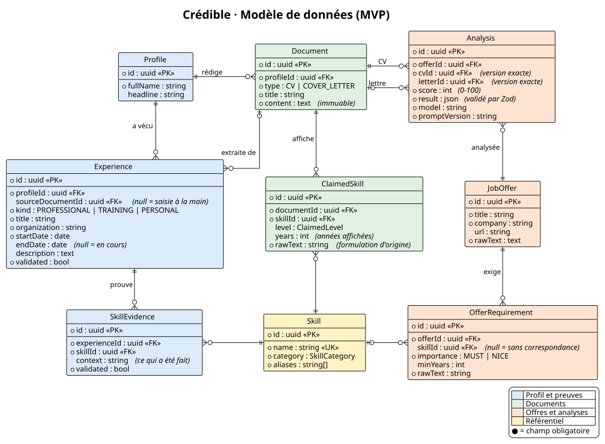

# Modèle de données (ERD)

Source : [diagrams/erd.puml](diagrams/erd.puml)

## Décisions de modélisation

| Décision                                                                                     | Raison                                                                                                                                                          |
| -------------------------------------------------------------------------------------------- | --------------------------------------------------------------------------------------------------------------------------------------------------------------- |
| Deux notions séparées : **preuve** (`SkillEvidence`) et **affichage** (`ClaimedSkill`)       | L'analyse d'honnêteté consiste à confronter ce qui est affiché à ce qui est prouvé. Pour ça, il faut les deux.                                                  |
| `ClaimedSkill` rattaché à un `Document`, et non au profil                                    | Deux versions du CV peuvent afficher des choses différentes. La lettre affiche aussi des compétences, ce qui permet la cohérence CV / lettre (US-08).           |
| Une seule table `Experience`, distinguée par `kind`                                          | Le classement « maîtrisé / vu en formation » découle directement du type d'expérience.                                                                          |
| Référentiel `Skill` avec des `aliases`                                                       | Permet de faire correspondre « Node », « NodeJS » et « Node.js ».                                                                                               |
| `validated` sur les éléments extraits                                                        | Seul ce que l'utilisateur a relu est utilisé dans l'analyse (US-02).                                                                                            |
| `Document` et `Analysis` immuables                                                           | Garantit un historique fiable (US-10) et la reproductibilité des évaluations.                                                                                   |
| `profileId` partout, alors qu'il n'y a qu'un seul profil                                     | Permet d'ajouter l'authentification plus tard sans refaire le schéma.                                                                                           |
| `ClaimedSkill.years`                                                                         | Permet de détecter qu'un nombre d'années affiché dépasse la durée réellement prouvée (US-07).                                                                   |
| `Experience` appartient au profil, et garde son document d'origine (`sourceDocumentId`)      | Une expérience est une vérité du profil : supprimer un CV ne la supprime pas (`SET NULL`). Le lien sert à la traçabilité et à US-14. `null` = saisie à la main. |
| `Analysis` pointe directement vers l'offre et les **versions exactes** du CV et de la lettre | Chaque analyse reste exacte même quand on colle une nouvelle version d'un document. L'historique d'une offre (US-10) se lit directement.                        |
| Pas de table `Application` dans le MVP                                                       | Le suivi des candidatures (US-11, US-12) est hors MVP. Il ajoutera une table dédiée (`offerId`, `status`, `appliedAt`), sans rien casser.                       |

## Données calculées (non stockées)

- **Durée prouvée pour une compétence** : somme des durées des expériences validées qui la prouvent.
- **Classement d'une exigence** : type d'expérience le plus fort parmi les preuves validées (`PROFESSIONAL` > `PERSONAL` / `TRAINING`).
