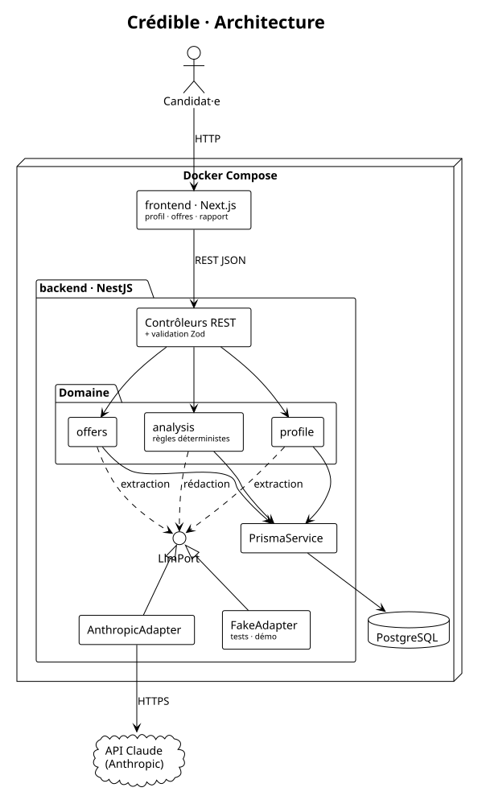

# Architecture

Source : [diagrams/architecture.puml](diagrams/architecture.puml)

## Principes

1. **Le LLM est derrière une interface** (`LlmPort`). Le domaine ne connaît pas Anthropic. En test et en démo, on branche un `FakeAdapter` qui renvoie des réponses enregistrées : les tests sont déterministes, rapides et gratuits.
2. **Les règles d'analyse sont des fonctions pures** : elles prennent en entrée les exigences, les preuves et les compétences affichées, et renvoient un classement, un score et des alertes. Elles n'accèdent ni à la base ni au LLM, et se testent unitairement avec Vitest.
3. **Zod à toutes les frontières** : entrées de l'API, sorties du LLM, et contenu de `Analysis.result`. Les mêmes schémas servent à valider les données et à typer le code.
4. **Le front ne parle qu'au backend.** Aucune clé d'API n'est exposée au navigateur.

## Modules backend

| Module     | Rôle                                                                                                                 |
| ---------- | -------------------------------------------------------------------------------------------------------------------- |
| `profile`  | Documents (CV, lettre) → extraction → validation des expériences et des preuves, détection des expériences nouvelles |
| `skills`   | Référentiel, rattachement d'un nom de compétence à une compétence canonique via les alias                            |
| `offers`   | Offre → extraction des exigences                                                                                     |
| `analysis` | Orchestration : charge les données, applique les règles, demande les formulations au LLM, enregistre l'`Analysis`    |
| `llm`      | `LlmPort` et ses adaptateurs, prompts versionnés                                                                     |
| `prisma`   | Accès à la base                                                                                                      |

## API (premier jet)

| Méthode                    | Route                             | Story                                                     |
| -------------------------- | --------------------------------- | --------------------------------------------------------- |
| `POST`                     | `/documents`                      | US-01 (et import de la lettre)                            |
| `POST`                     | `/documents/:id/extract`          | US-01, US-14                                              |
| `GET` / `PATCH` / `DELETE` | `/experiences/:id`                | US-02                                                     |
| `POST`                     | `/offers`                         | US-04 (extraction incluse)                                |
| `PATCH` / `DELETE`         | `/offers/:id/requirements/:reqId` | US-05                                                     |
| `POST`                     | `/offers/:id/analyses`            | US-06, 07, 08, 09 · corps : `cvId`, `letterId` facultatif |
| `GET`                      | `/offers/:id/analyses`            | US-10                                                     |

## Qualité et livraison

- **Local** : Husky, avec lint-staged (oxlint ou ESLint, puis Prettier) et commitlint.
- **CI GitHub Actions** : format, lint, typecheck, tests unitaires et e2e, build, puis images Docker de prod.
- **Jeu d'évaluation** : un script lance les extractions et les analyses sur de vraies candidatures anonymisées, puis compare aux résultats attendus.
